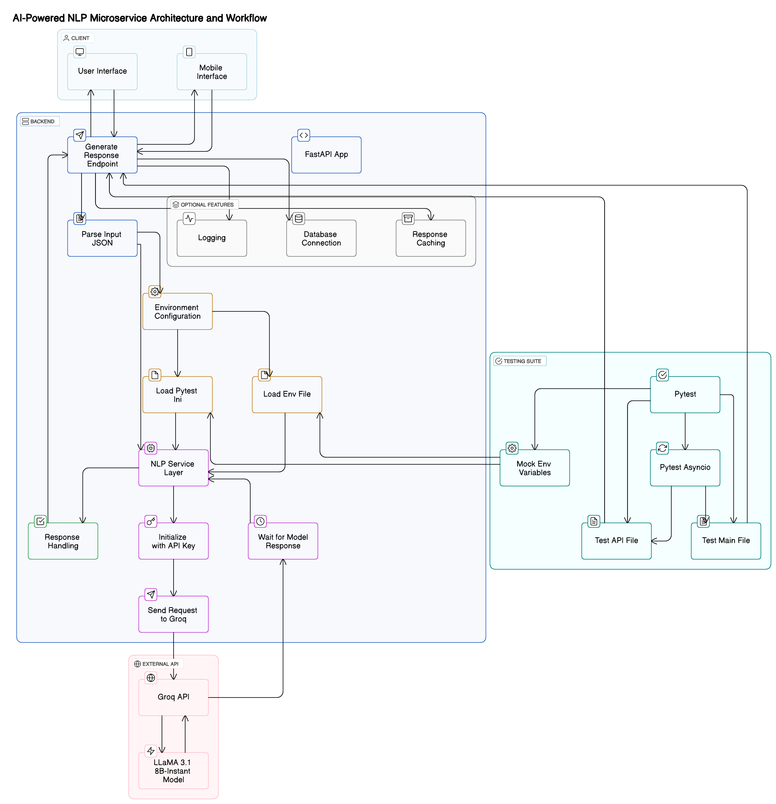

# RTDS - Real-Time Decision Support System

# We initially attempted to upload the video, but due to its large file size exceeding GitHub's limit, we later replaced it with an external link.

Video Demo Link 🔗 - https://drive.google.com/drive/folders/1mWOE4Ilz0lBpfWM9u8FQQJO6Cr-HmcM3?usp=sharing

A FastAPI-based application that provides natural language processing capabilities for cloud infrastructure management.

## Features

- Natural language processing for cloud operations
- Integration with Groq AI for advanced language understanding
- SQLite database for operation logging
- RESTful API endpoints for cloud resource management
- User authentication and session management

## Architecture



The system architecture consists of the following components:

- FastAPI backend server handling HTTP requests
- Groq AI integration for natural language processing
- SQLite database for operation logging
- OpenStack integration for cloud operations
- Frontend interface for user interaction

## Prerequisites

- Python 3.8+
- pip (Python package manager)
- Groq API key

## Installation

1. Clone the repository:

```bash
git clone https://github.com/yourusername/RTDS.git
cd RTDS
```

2. Create and activate a virtual environment:

```bash
python -m venv venv
source venv/bin/activate  # On Windows: venv\Scripts\activate
```

3. Install dependencies:

```bash
pip install -r requirements.txt
```

4. Create a `.env` file with your configuration:

```env
DATABASE_URL=sqlite:///./cloud_operations.db
GROQ_API_KEY=your_groq_api_key
```

5. Initialize the database:

```bash
python init_db.py
```

## Running the Application

1. Start the FastAPI server:

```bash
python run.py
```

2. The server will start at `http://localhost:8000`

## API Endpoints

- `POST /nl/process`: Process natural language requests for cloud operations
- `GET /docs`: Swagger UI documentation
- `GET /redoc`: ReDoc documentation

## Testing

Run the test suite:

```bash
python -m pytest app/tests/
```

## Project Structure

```
RTDS/
├── app/
│   ├── __init__.py
│   ├── main.py
│   ├── database.py
│   ├── services/
│   │   └── nlp_service.py
│   └── tests/
├── init_db.py
├── run.py
├── requirements.txt
└── README.md
```

## Contributing

1. Fork the repository
2. Create a feature branch
3. Commit your changes
4. Push to the branch
5. Create a Pull Request

## License

This project is licensed under the MIT License - see the LICENSE file for details.
